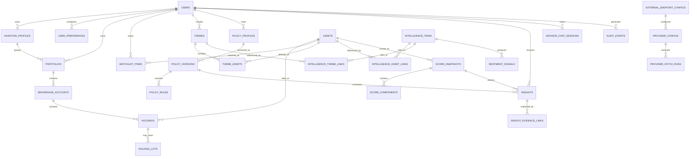

# Investment Intelligence Platform

## Database Model v0.1

Prepared: 2026-08-08

Status: Initial logical database model baseline

## 1. Purpose

This document defines the first logical PostgreSQL data model for the Investment Intelligence Platform.

The goal is to support the first personal-use build while keeping the schema flexible enough for future multi-user, multi-portfolio, public-ready expansion.

This is not yet a final migration script. Exact SQL DDL, constraints, and indexes should be finalized when the Spring Boot scaffold is created.

## 2. Database Principles

- Use PostgreSQL as the source of truth.
- Use UUID primary keys for durable public/internal references.
- Keep user ownership explicit, even in personal-use mode.
- Keep investor profile context separate from country/market-specific portfolios.
- Keep provider data separate from business decisions.
- Keep external provider endpoints configurable rather than hardcoded.
- Store source timestamps and provider names for explainability.
- Store policy, scoring, and insight snapshots rather than only latest state.
- Use JSONB only where flexibility is useful; do not hide core business fields inside JSON.
- Keep secrets out of the database unless encrypted and deliberately designed later.
- Prefer append-only history for audit-sensitive records.

## 3. Naming and Type Conventions

| Area | Convention |
|---|---|
| Table names | `snake_case`, plural where natural |
| Primary keys | `id uuid` |
| Foreign keys | `<entity>_id uuid` |
| Timestamps | `timestamptz` |
| Money values | `numeric(20, 6)` |
| Percentages | `numeric(9, 6)` |
| Quantities/shares | `numeric(24, 8)` |
| Flexible provider payloads | `jsonb` |
| Soft archive fields | `archived_at timestamptz`, where needed |
| Common timestamps | `created_at`, `updated_at` |

## 4. High-Level Relationship Map

## 5. MVP Table Set

The first build should start with this practical set:

- `users`
- `investor_profiles`
- `user_preferences`
- `portfolios`
- `brokerage_accounts`
- `assets`
- `holdings`
- `holding_lots`
- `holding_import_batches`
- `holding_import_rows`
- `portfolio_report_preferences`
- `watchlist_items`
- `themes`
- `theme_assets`
- `external_endpoint_configs`
- `provider_configs`
- `provider_fetch_runs`
- `intelligence_items`
- `intelligence_asset_links`
- `intelligence_theme_links`
- `sentiment_signals`
- `policy_profiles`
- `policy_versions`
- `policy_rules`
- `score_snapshots`
- `score_components`
- `insights`
- `insight_evidence_links`
- `advisor_chat_sessions`
- `advisor_chat_messages`
- `audit_events`

Some tables can begin with mock/manual data and become provider-driven later.

## 6. Identity and Profile

### users

Represents the application user. In v1 this can be a single personal user, but the schema should not assume only one user forever.

The first implementation should seed one local user instead of exposing registration/login. Future public use can add registration, login, email verification, password reset, and external authentication provider flows using this table and the `auth_subject` field.

| Field | Notes |
|---|---|
| `id` | Primary key |
| `display_name` | User-facing name |
| `email` | Optional in local personal mode; required later for public use |
| `auth_subject` | External auth identity later |
| `status` | active, disabled, archived |
| `created_at` | Creation timestamp |
| `updated_at` | Update timestamp |

### investor_profiles

Stores investor-level context that can differ from login identity.

| Field | Notes |
|---|---|
| `id` | Primary key |
| `user_id` | Owner |
| `profile_name` | Example: Personal Profile |
| `base_currency` | Default USD |
| `tax_residency_country` | Example: SG |
| `investment_objective` | Text summary |
| `risk_notes` | Text notes |
| `is_active` | Active profile flag |
| `created_at` | Creation timestamp |
| `updated_at` | Update timestamp |

### user_preferences

Stores UI and behavior preferences.

| Field | Notes |
|---|---|
| `id` | Primary key |
| `user_id` | Owner |
| `default_landing_page` | daily_brief, portfolio, discover, etc. |
| `explanation_mode` | beginner, detailed |
| `theme_mode` | light, dark, system |
| `advisor_memory_enabled` | User-controlled memory switch |
| `created_at` | Creation timestamp |
| `updated_at` | Update timestamp |

## 7. Portfolio and Holdings

### portfolios

Represents a portfolio owned by a user and linked to an investor profile.

Country-specific or market-specific portfolios should live here, not inside `investor_profiles`. For example, a Singapore tax-resident user may have a US Growth Portfolio, Singapore Income Portfolio, and India Watch Portfolio under the same investor profile.

| Field | Notes |
|---|---|
| `id` | Primary key |
| `user_id` | Owner |
| `investor_profile_id` | Profile context for tax/risk/personal settings |
| `name` | Example: US Portfolio |
| `portfolio_scope` | country_specific, multi_country, global, custom |
| `primary_market_country` | Example: US, SG, IN |
| `supported_market_countries` | JSONB list for multi-country/global portfolios |
| `base_currency` | Default USD |
| `primary_benchmark_symbol` | Default Nasdaq-100 Total Return proxy/config |
| `secondary_benchmark_symbol` | Default S&P 500 Total Return proxy/config |
| `market_notes` | Optional notes about portfolio geography or universe |
| `status` | active, archived |
| `created_at` | Creation timestamp |
| `updated_at` | Update timestamp |

### brokerage_accounts

Represents a manual or future broker-connected account.

| Field | Notes |
|---|---|
| `id` | Primary key |
| `portfolio_id` | Portfolio owner |
| `account_name` | User-facing name |
| `provider_name` | manual, alpaca, ibkr, etc. |
| `account_country` | Broker/account country, for example US, SG, IN |
| `account_type` | taxable, retirement, other |
| `connection_status` | manual, connected, disconnected, deferred |
| `created_at` | Creation timestamp |
| `updated_at` | Update timestamp |

### assets

Canonical instrument or asset reference.

| Field | Notes |
|---|---|
| `id` | Primary key |
| `symbol` | AAPL, QQQ, CASH, etc. |
| `asset_type` | stock, etf, cash, bond, fund, crypto, custom |
| `name` | Full name |
| `exchange` | NASDAQ, NYSE, etc. |
| `currency` | USD |
| `country` | Listing or domicile country |
| `sector` | Provider-normalized sector |
| `industry` | Provider-normalized industry |
| `is_active` | Active flag |
| `provider_metadata` | JSONB for provider identifiers |
| `created_at` | Creation timestamp |
| `updated_at` | Update timestamp |

### holdings

Represents current position-level ownership for an asset in an account.

| Field | Notes |
|---|---|
| `id` | Primary key |
| `portfolio_id` | Portfolio |
| `brokerage_account_id` | Account |
| `asset_id` | Asset |
| `quantity` | Shares/units |
| `average_cost` | Average buy price |
| `cost_basis` | Optional computed/stored basis |
| `portfolio_bucket` | core, satellite, cash, unclassified |
| `source` | manual, json_upload, broker_import |
| `notes` | User notes |
| `created_at` | Creation timestamp |
| `updated_at` | Update timestamp |

### holding_lots

Stores purchase-lot level detail when available.

| Field | Notes |
|---|---|
| `id` | Primary key |
| `holding_id` | Parent holding |
| `quantity` | Lot shares/units |
| `price` | Purchase price |
| `purchase_date` | Date from manual input or broker import |
| `source` | manual, json_upload, broker_import |
| `created_at` | Creation timestamp |
| `updated_at` | Update timestamp |

### holding_import_batches

Tracks JSON/manual import attempts.

| Field | Notes |
|---|---|
| `id` | Primary key |
| `portfolio_id` | Portfolio |
| `source_type` | json_upload, manual_entry, broker_import |
| `status` | previewed, imported, failed, cancelled |
| `file_name` | Optional uploaded file name |
| `raw_payload` | JSONB payload or summary |
| `created_at` | Creation timestamp |
| `completed_at` | Completion timestamp |

### holding_import_rows

Stores row-level validation results before/after import.

| Field | Notes |
|---|---|
| `id` | Primary key |
| `batch_id` | Import batch |
| `row_number` | Row order |
| `symbol` | Parsed ticker |
| `quantity` | Parsed shares |
| `average_cost` | Parsed average price |
| `purchase_date` | Parsed date |
| `validation_status` | valid, warning, invalid |
| `validation_messages` | JSONB list |
| `created_holding_id` | Holding created/updated after import |
| `raw_row` | JSONB original row |

### portfolio_report_preferences

Stores user-selectable portfolio report visualization preferences.

| Field | Notes |
|---|---|
| `id` | Primary key |
| `user_id` | Owner |
| `portfolio_id` | Portfolio |
| `report_key` | overview, risk, allocation, custom |
| `visualization_key` | core_satellite_cash, asset_class_allocation, sector_allocation, country_market_exposure, currency_exposure, theme_exposure, account_allocation, holding_concentration |
| `display_name` | User-facing chart name |
| `chart_type` | donut, pie, bar, stacked_bar, treemap, table |
| `is_visible` | Whether chart appears in the report |
| `display_order` | Sort order |
| `config` | JSONB settings such as thresholds, colors, percent/value toggle, benchmark comparison |
| `created_at` | Creation timestamp |
| `updated_at` | Update timestamp |

## 8. Watchlist and Themes

### watchlist_items

Tracks assets or ideas the user wants to monitor without buying.

| Field | Notes |
|---|---|
| `id` | Primary key |
| `user_id` | Owner |
| `asset_id` | Nullable for custom ideas |
| `title` | Custom idea title if no asset |
| `item_type` | stock, etf, sector, theme, technology, custom |
| `source_type` | article, friend, newsletter, social, manual, system_suggested |
| `source_reference` | URL or text reference |
| `reason_to_track` | User note |
| `status` | active, archived, promoted_to_research |
| `created_at` | Creation timestamp |
| `updated_at` | Update timestamp |

### themes

Tracks manually created or system-suggested sectors, technologies, or narratives.

| Field | Notes |
|---|---|
| `id` | Primary key |
| `user_id` | Owner |
| `name` | Example: Space Economy |
| `description` | Theme description |
| `theme_type` | sector, technology, narrative, custom |
| `creation_source` | manual, system_suggested |
| `status` | active, archived |
| `created_at` | Creation timestamp |
| `updated_at` | Update timestamp |

### theme_assets

Links assets to themes.

| Field | Notes |
|---|---|
| `id` | Primary key |
| `theme_id` | Theme |
| `asset_id` | Asset |
| `relationship_type` | core_exposure, adjacent, speculative, supplier, customer |
| `confidence` | low, medium, high |
| `created_at` | Creation timestamp |

## 9. Provider and Intelligence Data

### external_endpoint_configs

Stores configurable external endpoint metadata for provider APIs, broker APIs, AI model endpoints, alert webhooks, or other integrations. This table should store non-secret endpoint settings only.

| Field | Notes |
|---|---|
| `id` | Primary key |
| `name` | User/admin-facing endpoint name |
| `endpoint_type` | provider_api, broker_api, ai_model, alert_webhook, custom |
| `provider_name` | alpaca, alpha_vantage, finnhub, apewisdom, stockgeist, openai, etc. |
| `environment` | local, sandbox, production |
| `base_url` | Configurable base URL |
| `api_version` | Optional API version |
| `auth_type` | none, api_key, oauth, bearer_token, basic, custom |
| `secret_reference` | Environment-variable name or secret-manager reference, not the raw secret |
| `timeout_ms` | Request timeout |
| `retry_policy` | JSONB retry/backoff settings |
| `rate_limit_config` | JSONB rate-limit settings |
| `enabled` | Whether endpoint is active |
| `metadata` | JSONB non-secret settings |
| `created_at` | Creation timestamp |
| `updated_at` | Update timestamp |

### provider_configs

Stores provider configuration metadata but not raw secrets. Provider configurations may point to an `external_endpoint_configs` record so endpoints can be changed without code changes.

| Field | Notes |
|---|---|
| `id` | Primary key |
| `endpoint_config_id` | Linked configurable endpoint |
| `provider_name` | alpaca, alpha_vantage, finnhub, apewisdom, stockgeist |
| `provider_type` | market_data, news, social_sentiment, filings |
| `active_environment` | local, sandbox, production |
| `enabled` | Whether provider is active |
| `config_metadata` | JSONB non-secret settings |
| `created_at` | Creation timestamp |
| `updated_at` | Update timestamp |

### provider_fetch_runs

Tracks ingestion runs from providers or mock providers.

| Field | Notes |
|---|---|
| `id` | Primary key |
| `provider_config_id` | Provider config |
| `run_type` | quote_refresh, news_refresh, sentiment_refresh, fundamentals_refresh |
| `status` | started, succeeded, failed, partial |
| `started_at` | Run start |
| `completed_at` | Run completion |
| `records_received` | Count |
| `records_saved` | Count |
| `error_summary` | Text summary |

### intelligence_items

Stores normalized news, articles, announcements, deals, projects, and narratives.

| Field | Notes |
|---|---|
| `id` | Primary key |
| `provider_name` | Source provider |
| `provider_item_id` | Provider-specific ID |
| `item_type` | news, article, announcement, deal, project, social_post, filing |
| `headline` | Title/headline |
| `summary` | Normalized summary |
| `source_name` | Publisher/source |
| `source_url` | URL when available |
| `published_at` | Source published timestamp |
| `retrieved_at` | System retrieval timestamp |
| `source_confidence` | low, medium, high |
| `raw_payload` | JSONB provider payload |
| `created_at` | Creation timestamp |

### intelligence_asset_links

Links intelligence items to assets.

| Field | Notes |
|---|---|
| `id` | Primary key |
| `intelligence_item_id` | Intelligence item |
| `asset_id` | Asset |
| `relationship_type` | mentioned, primary_subject, competitor, supplier, customer |
| `confidence` | low, medium, high |

### intelligence_theme_links

Links intelligence items to themes.

| Field | Notes |
|---|---|
| `id` | Primary key |
| `intelligence_item_id` | Intelligence item |
| `theme_id` | Theme |
| `relationship_type` | mentioned, theme_driver, hype_signal, risk_signal |
| `confidence` | low, medium, high |

### sentiment_signals

Stores sentiment observations from news/social/intelligence sources.

| Field | Notes |
|---|---|
| `id` | Primary key |
| `asset_id` | Nullable if theme-only |
| `theme_id` | Nullable if asset-only |
| `intelligence_item_id` | Optional source item |
| `provider_name` | Source provider |
| `signal_type` | news_sentiment, social_sentiment, hype_signal, risk_signal |
| `sentiment_score` | Normalized score, for example -1 to +1 |
| `sentiment_label` | bearish, neutral, bullish, mixed |
| `confidence` | low, medium, high |
| `captured_at` | Timestamp |
| `raw_payload` | JSONB details |

## 10. Policy Engine

### policy_profiles

Stores the policy container for a user/profile. A policy can be profile-level or portfolio-specific.

| Field | Notes |
|---|---|
| `id` | Primary key |
| `user_id` | Owner |
| `investor_profile_id` | Linked profile |
| `portfolio_id` | Optional portfolio-specific policy |
| `name` | Example: Personal Investment Policy |
| `scope_type` | profile, portfolio, global, custom |
| `jurisdiction_scope` | Example: SG tax resident, US-listed assets |
| `market_scope` | Example: US, SG, IN, global |
| `status` | active, archived |
| `created_at` | Creation timestamp |
| `updated_at` | Update timestamp |

### policy_versions

Stores versioned policy snapshots.

| Field | Notes |
|---|---|
| `id` | Primary key |
| `policy_profile_id` | Policy profile |
| `version_label` | Example: policy-v0.3 |
| `primary_benchmark` | Nasdaq-100 Total Return |
| `secondary_benchmark` | S&P 500 Total Return |
| `cash_target_percentage` | Flexible 15% target |
| `satellite_max_percentage` | 20% |
| `drawdown_review_min_percentage` | 15% |
| `drawdown_review_max_percentage` | 25% |
| `is_active` | Active version flag |
| `effective_from` | Version start |
| `created_at` | Creation timestamp |

### policy_rules

Stores configurable policy rules.

| Field | Notes |
|---|---|
| `id` | Primary key |
| `policy_version_id` | Policy version |
| `rule_key` | Example: shell_company_positive_label_block |
| `rule_type` | eligibility, concentration, cash, benchmark, risk, labeling |
| `severity` | info, warning, blocker |
| `rule_config` | JSONB versioned rule settings |
| `created_at` | Creation timestamp |

## 11. Scoring Engine

### score_snapshots

Stores score output snapshots for assets, watchlist items, or themes.

| Field | Notes |
|---|---|
| `id` | Primary key |
| `user_id` | Owner |
| `asset_id` | Nullable for theme-only/custom scoring |
| `theme_id` | Nullable |
| `watchlist_item_id` | Nullable |
| `score_version` | Example: score-framework-v0.1 |
| `policy_version_id` | Policy used during scoring |
| `overall_label` | Optional aggregate label |
| `confidence` | low, medium, high |
| `supporting_signals` | JSONB |
| `conflicting_signals` | JSONB |
| `missing_evidence` | JSONB |
| `data_freshness` | JSONB |
| `generated_at` | Score timestamp |
| `raw_response` | JSONB full response |

### score_components

Stores individual category scores.

| Field | Notes |
|---|---|
| `id` | Primary key |
| `score_snapshot_id` | Parent score snapshot |
| `component_key` | eligibility_gate, policy_fit, quality, valuation, risk, sentiment_intelligence, technical_timing, confidence |
| `numeric_value` | Optional numeric value |
| `label` | Plain-language label |
| `confidence` | low, medium, high |
| `supporting_signals` | JSONB |
| `conflicting_signals` | JSONB |
| `missing_evidence` | JSONB |

## 12. Insights

### insights

Stores safe, non-execution insight records.

| Field | Notes |
|---|---|
| `id` | Primary key |
| `user_id` | Owner |
| `portfolio_id` | Optional portfolio context |
| `asset_id` | Nullable for theme/custom insight |
| `theme_id` | Nullable |
| `watchlist_item_id` | Nullable |
| `score_snapshot_id` | Score that informed the insight |
| `policy_version_id` | Policy version used |
| `label` | Track, Research Further, Criteria Approaching, Risk Review, Policy Warning, Data Insufficient, High-Risk Tracking |
| `title` | User-facing title |
| `summary` | Explanation summary |
| `status` | active, dismissed, archived |
| `generated_at` | Generation timestamp |
| `created_at` | Creation timestamp |
| `updated_at` | Update timestamp |

### insight_evidence_links

Links insights to evidence.

| Field | Notes |
|---|---|
| `id` | Primary key |
| `insight_id` | Insight |
| `evidence_type` | score_snapshot, intelligence_item, sentiment_signal, policy_rule, holding, watchlist_item |
| `evidence_id` | UUID of referenced evidence |
| `relevance_label` | supporting, conflicting, missing, warning |
| `created_at` | Creation timestamp |

## 13. Advisor Chat and Explainability

### advisor_chat_sessions

Stores chat sessions.

| Field | Notes |
|---|---|
| `id` | Primary key |
| `user_id` | Owner |
| `title` | Session title |
| `memory_enabled_at_start` | Snapshot of user memory setting |
| `created_at` | Creation timestamp |
| `updated_at` | Update timestamp |

### advisor_chat_messages

Stores chat messages and response metadata.

| Field | Notes |
|---|---|
| `id` | Primary key |
| `session_id` | Chat session |
| `role` | user, assistant, system |
| `content` | Message text |
| `context_summary` | Summary of context used |
| `linked_insight_id` | Optional insight reference |
| `linked_score_snapshot_id` | Optional score reference |
| `model_provider` | Optional future AI provider |
| `model_name` | Optional model name |
| `created_at` | Creation timestamp |

## 14. Audit and Journal

### audit_events

Stores important user/system actions.

| Field | Notes |
|---|---|
| `id` | Primary key |
| `user_id` | Owner |
| `event_type` | holding_imported, policy_changed, score_generated, insight_created, watchlist_updated, chat_saved |
| `entity_type` | affected entity type |
| `entity_id` | affected entity ID |
| `summary` | Human-readable event summary |
| `metadata` | JSONB details |
| `created_at` | Event timestamp |

## 15. Suggested Indexes

Initial indexing candidates:

- `assets(symbol, asset_type)`
- `portfolios(investor_profile_id, status)`
- `portfolios(primary_market_country, status)`
- `holdings(portfolio_id, asset_id)`
- `portfolio_report_preferences(user_id, portfolio_id, report_key, display_order)`
- `holding_lots(holding_id, purchase_date)`
- `watchlist_items(user_id, status)`
- `themes(user_id, status)`
- `theme_assets(theme_id, asset_id)`
- `external_endpoint_configs(endpoint_type, provider_name, environment)`
- `provider_configs(provider_name, provider_type, active_environment)`
- `intelligence_items(published_at)`
- `intelligence_asset_links(asset_id)`
- `intelligence_theme_links(theme_id)`
- `sentiment_signals(asset_id, captured_at)`
- `sentiment_signals(theme_id, captured_at)`
- `policy_versions(policy_profile_id, is_active)`
- `score_snapshots(user_id, asset_id, generated_at)`
- `insights(user_id, status, generated_at)`
- `audit_events(user_id, created_at)`

## 16. MVP vs Later

### Required for first working build

- User/profile placeholder
- Portfolio and account setup
- Asset reference data
- Manual holdings
- JSON upload preview/import
- Watchlist and themes
- Policy profile/version
- Mock scoring snapshots
- Safe insights
- Audit events

### Can remain mock/manual initially

- Provider fetch runs
- Intelligence ingestion
- Sentiment signals
- Advisor Chat messages

### Later expansion

- Broker import integration
- Full recommendation engine
- Suitability framework
- Multi-user authentication
- External alerts
- Additional asset classes
- AI model provider abstraction
- Dedicated scoring service

## 17. Open Decisions

These should be decided when implementation begins:

- Whether to use Flyway or Liquibase for migrations.
- Whether to use JPA entities directly or jOOQ for database access.
- Whether to store all score component details normalized or partly in JSONB.
- Whether to treat holdings as aggregate positions only, lot-level records only, or both.
- Whether provider raw payloads should be retained forever or expire after a retention period.
- Whether Advisor Chat memory requires a separate long-term memory table in v1.
